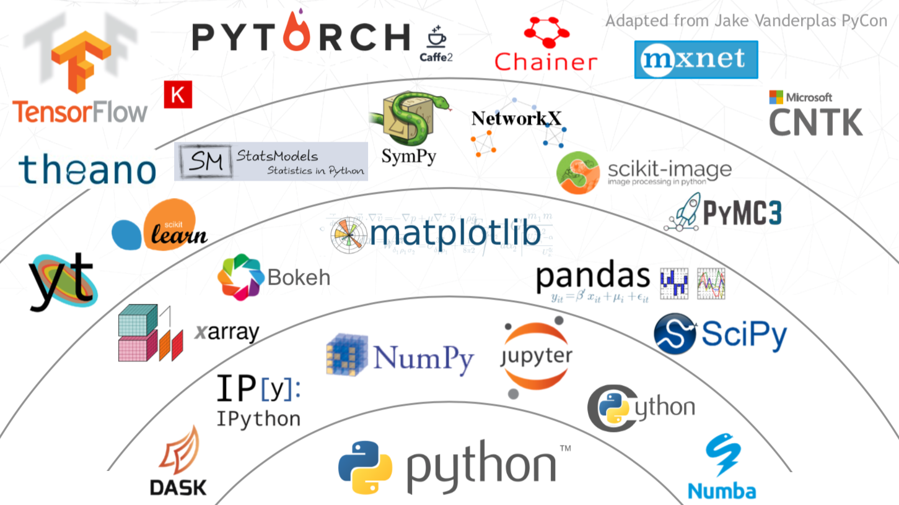

## How Contributing to Open Source Can Help Advance Your Career

### Thomas J Fan - @thomasjpfan

### Scikit-learn Core Developer

---

---

# Disclaimer 😇

1. Finance Support
2. Employee Time
3. Organize Events
4. Visual Design

---

## Focus on Programming 🖥

---

# Technical Skills 🤓

---

## 1. Reading Code 📖

---

## 2. Coding Practice ⌨️

---

## 3. Debugging 🐛

---

# Soft Skills 🍦

---

## 1. Code Reviews 🔬

---

## 2. Writing 🖊

---

## 3. Low and High Level Discussions 🗣

---

# Intangibles 🤗

1. Fun
2. Confidence
3. Community

---

## How to Contribute Code to Open Source? 🛠

---

## 1. Git & Github 🗿

---

## 2. Find a Project 🕵️‍♂️

---

## 3. Read all the things📚

---

## 4a. Find Issue 🔭

---

# 4b. Submit Issue 🛳

i. Context
ii. Research
iii. Discuss

---

## 5. Fork 🍴

---

## 6. Build & Test Locally 🧱

---

## 7. Make Changes ⏱

---

## 8. Pull Request 🥳

---

## 9. What Now? 🥴

---

## 10. PR Merged! 🚀

---

## Demo 😱

---

## Questions ⁉️

### Thomas J Fan - @thomasjpfan
